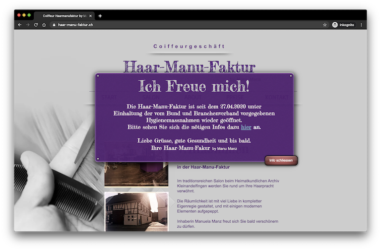
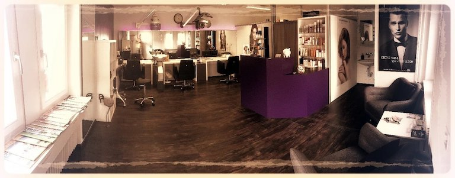
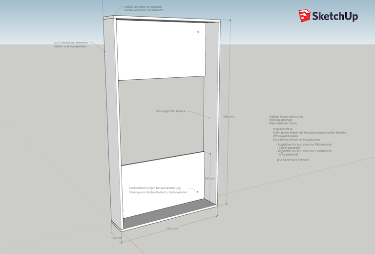
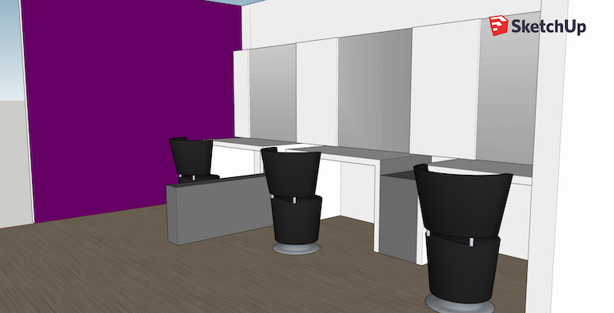

# Haar-Manu-Faktur Coiffeurgeschäft

Webdesign sowie Planung und Umbau des Salons.
{: .fs-6 .fw-300 }
[haar-manu-faktur.ch](https://www.haar-manu-faktur.ch/){:target="_blank"}
{: .fs-6 .fw-300 }

Der ganze Salon wurde gemeinsam zum optimalen Umbau gebracht. Diese Umbauphase wurde 2015 komplett von mir gepalnt und umgesetzt.
{: .fs-6 .fw-300 }

Aktuell wird am gleichen Objekt eine neue Speigelwand mit kleinen Schränken geplant. Dazu wird nach einer gründlichen Besprechnung und Mass nehmen jeweils mit 3D Zeichnungen aufgezeigt wie das Endergebnis in etwa wirkt. So können Sie sich ein gutes Bild über das Endergebnis machen und allfällige Änderungen frühzeitig einfliessen lassen.
{: .fs-6 .fw-300 }

